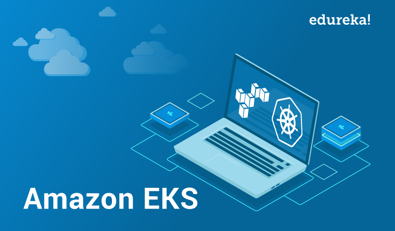

# ELASTIC KUBERNETES SERVICE : PROJECT


> This project is a part of my EKS training under the mentorship of **Mr. Vimal Daga**

# 1.	INTRODUCTION 
Amazon Elastic Kubernetes Service (Amazon EKS) is a fully managed Kubernetes service which has capability to leverage all the services of AWS like EFS, ELB, EC2, VPC, etc……

## The Following Diagram shows the basic working of EKS Service .


## Basic Kubernetes Cluster Setup : 


### We need 2 categories of programs in order deploy and access  Kubernetes Cluster :

  1.	**Client Program** : Kubectl
  2.	**Cluster Creation Program :** 
  
      There are 3 ways to Interact/ access the EKS service : 
      
          •	AWS WebUI
          •	CLI : using default AWS commands
          •	CLI : using 3rd party command : ekctl 
          
### Internally, Kubernetes requires the following programs/ Applications  :

**1.	In Master node :**

      i.	API server : takes requests from clients
      ii.	Kube Scheduler : Decides in which node to implement the client’s request 
      iii.	Kube Controller : Controls the nodes
      iv.	ETCD : Database of Kubernetes
      
**2.	In worker node:**

      i.	KubeLet : Takes requests from master
      ii.	Container Engine : to launch Pods Containers


# 2.	PROJECT PLAN 
This projects aims at deploying a Kubernetes Multinode cluster on top Of AWS cloud i.e. Deploying EKS cluster.
The Cluster will have the following Integrations:
- MySql
- Wordpress
- Prometheus
- Grafana

## PreRequisites
- [x] Make an account on AWS
- [x] Download eksctl command in your local system
- [x] Download Kubectl command in your local system
- [x] Download HELM command in your local system

# 3.	PROJECT IMPLEMENTATION
## 1. Launch the EKS Cluster on AWS CLoud
For this, we have to write a **YAML file** to define the specifications of the cluster like : 
- Type of Resource
- name and region of cluster
- specifications of Node Groups inside the cluster : 
  - Name of node group
  - Number of nodes inside the node group
  - Instance type of Pod to be launched in each Nodegroup
  - Key: to enable ssh
```
apiVersion: eksctl.io/v1alpha5
kind: ClusterConfig
metadata:
  name: ekscluster
  region: ap-south-1
nodeGroups:
   - name: nodegroup1
     desiredCapacity: 3
     instanceType: t2.micro
     ssh:
        publicKeyName: instancekey
```
> Find the above code in the GitHub repo with the name : **cluster.yml**

### To launch this cluster :
```
eksctl create cluster -f cluster.yml
```
***So this will launch our Kubernetes Cluster on the AWS cloud...!!!***


