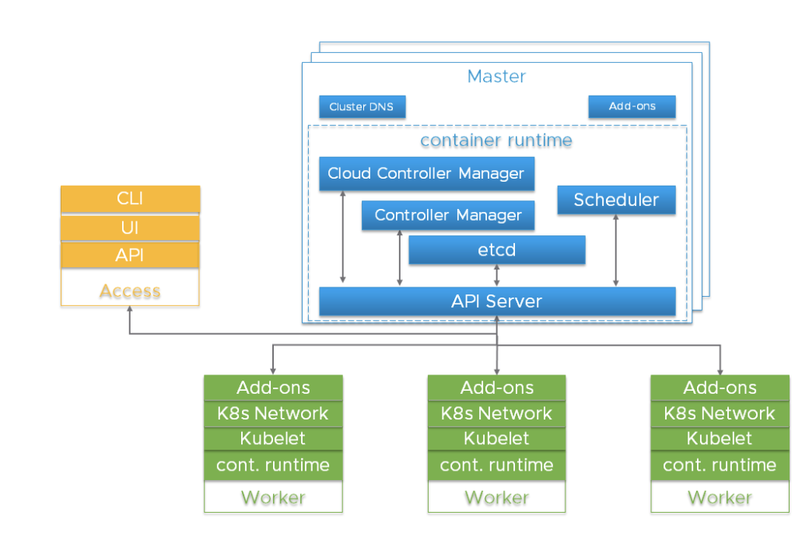

# ELASTIC KUBERNETES SERVICE

> This project is a part of my
EKS training under the mentorship of 
Mr. Vimal Daga

## 1.	INTRODUCTION 
Amazon Elastic Kubernetes Service (Amazon EKS) is a fully managed Kubernetes service which has capability to leverage all the services of AWS like EFS, ELB, EC2, VPC, etc……

### The Following Diagram shows the basic working of EKS Service .

### Basic Kubernetes Cluster Setup : 

We need 2 categories of programs in order deploy and access  Kubernetes Cluster :

  1.	**Client Program** : Kubectl
  2.	**Cluster Creation Program :** 
  
      There are 3 ways to Interact/ access the EKS service : 
      
          •	AWS WebUI
          •	CLI : using default AWS commands
          •	CLI : using 3rd party command : ekctl 
          
Internally, Kubernetes requires the following programs/ Applications  :

**1.	In Master node :**

      i.	API server : takes requests from clients
      ii.	Kube Scheduler : Decides in which node to implement the client’s request 
      iii.	Kube Controller : Controls the nodes
      iv.	ETCD : Database of Kubernetes
      
**2.	In worker node:**

      i.	KubeLet : Takes requests from master
      ii.	Container Engine : to launch Pods Containers

## 2.	PROJECT PLAN 
This projects aims at deploying a Kubernetes Multinode cluster on top Of AWS cloud i.e. Deploying EKS cluster.
The Cluster will have the following Integrations:

- MySql
- Wordpress
- Prometheus
- Grafana

## PreRequisites
- [x] Make an account on AWS
- [x] Download eksctl command in your local system
- [x] Download Kubectl command in your local system
- [x] Download HELM command in your local system

## 3.	PROJECT IMPLEMENTATION
### Preparing the Codes
1. 

