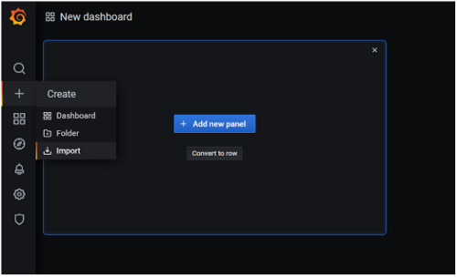

# ELASTIC KUBERNETES SERVICE : PROJECT


> This project is a part of my EKS training under the mentorship of **Mr. Vimal Daga**

# 1.	INTRODUCTION 
Amazon Elastic Kubernetes Service (Amazon EKS) is a fully managed Kubernetes service which has capability to leverage all the services of AWS like EFS, ELB, EC2, VPC, etc……

## The Following Diagram shows the basic working of EKS Service .


## Basic Kubernetes Cluster Setup : 


### We need 2 categories of programs in order deploy and access  Kubernetes Cluster :

  1.	**Client Program** : Kubectl
  2.	**Cluster Creation Program :** 
  
      There are 3 ways to Interact/ access the EKS service : 
      
          •	AWS WebUI
          •	CLI : using default AWS commands
          •	CLI : using 3rd party command : ekctl 
### HELM


Helm is the **package manager** for kbernetes just like we have yum in RHEL8
Helm Charts help in *downloading--> Installing--> launching* the complete APPlications in one go!! 

### Internally, Kubernetes requires the following programs/ Applications  :

**1.	In Master node :**

      i.	API server : takes requests from clients
      ii.	Kube Scheduler : Decides in which node to implement the client’s request 
      iii.	Kube Controller : Controls the nodes
      iv.	ETCD : Database of Kubernetes
      
**2.	In worker node:**

      i.	KubeLet : Takes requests from master
      ii.	Container Engine : to launch Pods Containers


# 2.	PROJECT PLAN 
- This projects aims at deploying a Kubernetes Multinode cluster on top Of AWS cloud i.e. Deploying EKS cluster.
- The RealTime Metrics of the Cluster will be Fetched and Monitored by ***Prometheus***
- The Metrics can then be visualized via ***Grafana***


## PreRequisites
- [x] Make an account on AWS
- [x] Download eksctl command in your local system
- [x] Download Kubectl command in your local system
- [x] Download HELM command in your local system

# 3.	PROJECT IMPLEMENTATION

## 1. Launch the EKS Cluster on AWS CLoud
### For this, we have to write a ***YAML file*** to define the specifications of the cluster like : 
- Type of Resource
- name and region of cluster
- specifications of Node Groups inside the cluster : 
  - Name of node group
  - Number of nodes inside the node group
  - Instance type of Pod to be launched in each Nodegroup
  - Key: to enable ssh
```
apiVersion: eksctl.io/v1alpha5
kind: ClusterConfig
metadata:
  name: ekscluster
  region: ap-south-1
nodeGroups:
   - name: nodegroup1
     desiredCapacity: 3
     instanceType: t2.micro
     ssh:
        publicKeyName: instancekey
```
> Find the above code in the GitHub repo with the name : **cluster.yml**

### To launch this cluster :
```
eksctl create cluster -f cluster.yml
```
***So this will launch our Kubernetes Cluster on the AWS cloud...!!!***


## 2. SetUp Prometheus Server on K8s Cluster via HELM : ***Package Manager for Kubernetes***
**1. Create Namespace to isolate the Prometheus space :**
```
kubectl create namespace prometheus
```
**2. Install HELM chart for prometheus :**
```
helm install stable/prometheus --namespace prometheus --set alertmanager.persistentVolume.storageClass="gp2" --set server.persistentVolume.storageClass="gp2"
```
The above command will install Helm Chart for Prometheus from helm hub and will also Create a **PV** for the storage class named **gp2**

**3. Connect to the load balancer of K8s**
```
kubectl -n prometheus  port-forward svc/riding-hedgehorn-prometheus-server  8888:80
```
**4. Verify the Prometheus setup opening the Prometheus WebUI**

Open the Prometheus WebUI in the browser and if the above setup is deployed successfully, then we can see the Prometheus Dashboard .!!!


This is the Dashboard of Prometheus.
>To explore more, we can see the targets and graphs of our Cluster Nodes being monitored by Prometheus and can use PromQL to search within the Prometehus Database which is the PV Specified in step 2.


## SetUp Grafana for Visualizing the Prometheus Metrics
**1. Create Namespace to isolate the Grafana space :**
```
kubectl create namespace grafana
```
**2. Install HELM chart for grafana :**
```
helm install grafana/stable  --namespace grafana  --set persistence.storageClassName="gp2"  --set adminPasswod=redhat  --set service.type=LooadBalancer
```
The above command will:
- install Helm Chart for Grafana from helm hub 
- Create a **PV** for the storage class named **gp2**
- Create a password for Grafana WebUI
- Setup a Load Balancer for Grafana nodes

**3. Open The Grafana WebUI**
Open the Grafana WEBUI in the browser and if everything goes fine, then we will see the Grafana Login Dashboard as below :


**4. Importing Precreated Dashboard into grafana**
- Open  **GrafanaLabs** webPage 
- Search For Prometheus Dashboard 


- Select the following dashboard and copy its ID :


**5. Import it in Grafana**
- In Grafana WebUI --> Left Pane --> + --> Import



- Select the Data Source as Prometheus

- Launch The Dashboard


***SO, FINALLY, WE HAVE CREATED A GRAPHANA DASHBOARD TO VISUALIZE THE REAL TIME LOGS OF THE NODES OF KUBERNETES CLUSTER COLLECTED BY PROMETHEUS !!!!***
